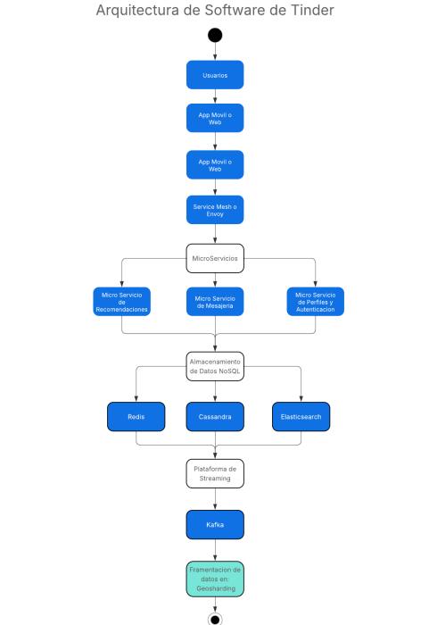

# Arquitectura de Tinder

## Introducción
Tinder, lanzada en 2012, es una plataforma global de citas en línea disponible en más de 190 países.  
Su naturaleza se basa en alto volumen de interacciones millones de swipes diarios, haciendo crucial una arquitectura que permita **escalabilidad, baja latencia, disponibilidad global y seguridad**, especialmente ante tráfico malicioso y protección de datos sensibles.

## Arquitectura

### Estilos
- **Microservicios**: más de 500 servicios independientes especializados en funciones como recomendaciones, mensajería, perfiles, geolocalización, autenticación y medios.  
- **Service Mesh**: facilita la comunicación segura, el descubrimiento de servicios y la resiliencia interna.  
- **API Gateway (TAG)**: desarrollado internamente sobre Spring Cloud Gateway, centraliza el acceso público, controla la seguridad, el tráfico y los filtros personalizados.  
- **Orientación a eventos**: uso de Apache Kafka para garantizar orden y consistencia en actualizaciones de usuarios.  

### Componentes
- **Clientes**: aplicaciones móviles y web.  
- **TAG**: recibe las peticiones externas, aplica filtros de seguridad, limita la tasa de uso y redirige hacia los microservicios.  
- **Microservicios**: desplegados en contenedores sobre Kubernetes, se comunican mediante el service mesh.  
- **Capa de datos**:
  - Redis: caché para respuestas rápidas.  
  - Cassandra: base de datos distribuida para registrar swipes y eventos masivos.  
  - Elasticsearch: consultas rápidas geoespaciales, alimentado por captura de cambios (CDC).  
- **Sistema de recomendaciones**: basado en geosharding, que segmenta usuarios por ubicación mediante la librería S2 de Google.  

### Justificación
- **Escalabilidad**: microservicios y Kubernetes permiten crecer según demanda.  
- **Disponibilidad y resiliencia**: redundancia, balanceo global y tolerancia a fallos mediante Envoy y TAG.  
- **Baja latencia**: Redis, geosharding y Elasticsearch aceleran las respuestas.  
- **Consistencia de datos**: Kafka asegura el orden en los eventos y sincronización en los geoshards.  
- **Seguridad**: TAG filtra bots, aplica autenticación y protege de tráfico malicioso.  

# Arquitectura de Tinder

## Requerimientos

### Funcionales
- Swipe y generación de matches.  
- Recomendaciones basadas en ubicación.  
- Gestión de perfiles y autenticación.  
- Mensajería entre usuarios que hicieron match.  
- Manejo de fotos y medios.  

### No funcionales
- Alta disponibilidad (99.99%).  
- Escalabilidad global para soportar picos de tráfico.  
- Baja latencia en swipes y recomendaciones.  
- Seguridad contra ataques y fraudes.  
- Tolerancia a fallos con aislamiento de servicios.  
- Consistencia eventual mediante procesamiento de eventos.  

## Análisis de atributos de calidad
- **Modularidad y mantenibilidad**: cada microservicio se despliega y actualiza de forma independiente.  
- **Escalabilidad**: Kubernetes y las bases distribuidas permiten asignar recursos dinámicamente.  
- **Disponibilidad y resiliencia**: combinación de TAG, Envoy y service mesh con redundancia global.  
- **Seguridad**: control de acceso centralizado en el API Gateway y uso de certificados mTLS en la malla de servicios.  
- **Consistencia**: Kafka mantiene el orden de los eventos críticos.  
- **Performance**: caché distribuido y consultas optimizadas reducen la latencia.  

## Conclusión crítica
La arquitectura de Tinder, basada en **microservicios, API Gateway propio, service mesh, bases distribuidas y eventos con Kafka**, le permite sostener millones de interacciones en tiempo real con alta disponibilidad, baja latencia y seguridad global.  

Sus principales **trade-offs** son:  
- Complejidad operativa de mantener más de 500 microservicios.  
- Altos costos de infraestructura.  
- Dificultad de monitoreo en un entorno tan distribuido.  

Este caso demuestra la importancia de diseñar sistemas modulares, resilientes y escalables desde el inicio.  
Incluso en proyectos más pequeños, aplicar principios como **desacoplamiento, pruebas de resiliencia y uso de caché** asegura un crecimiento sostenible y mantenible.  

---

Arquitectura de Tinder: **[Arquitectura de Tinder.pdf](./Arquitectura de Tinder.pdf)**
Referencias: **[references.md](./references.md)**
